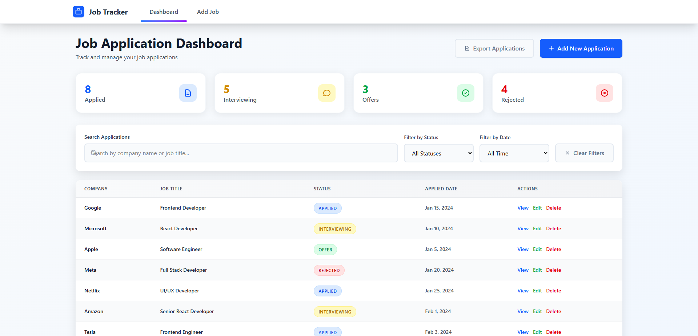
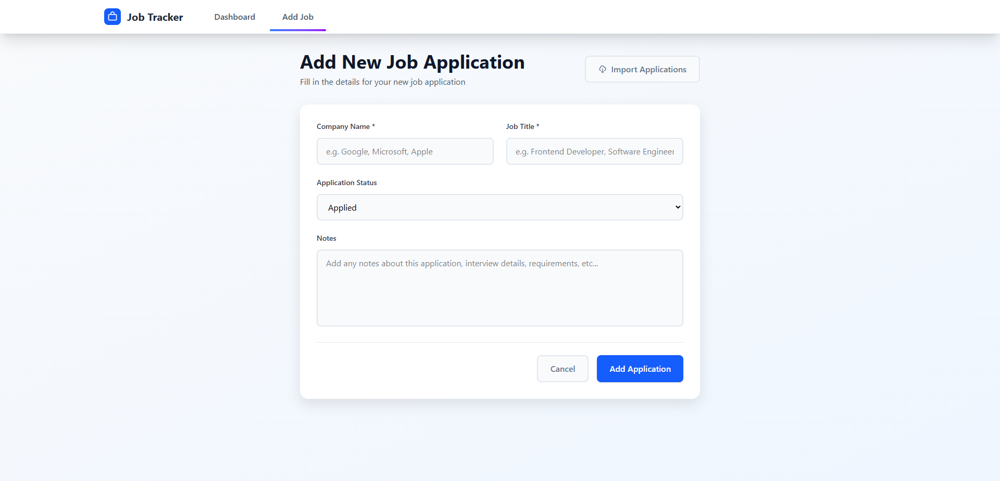

# Job Application Tracker






A full-featured, responsive web application built with React, Vite, Redux Toolkit, and Tailwind CSS that allows users to track their job applications. This project was developed as part of the Elevvo Internship Program.

## Features

### Core Functionality
- **Dashboard**: Display a list of saved job applications with company name, job title, application status, and applied date
- **Add Job Page**: Form for entering new job applications with fields for:
  - Company name
  - Job title
  - Status (Applied, Interviewing, Offer, Rejected)
  - Application date (auto-generated)
  - Notes
- **Job Details Page**: View full details of any job application including the ability to edit or delete
- **Edit Job Page**: Update existing job applications


### Technologies Used
- **React 19**: Frontend framework
- **Vite**: Build tool and development server
- **Redux Toolkit**: State management
- **React Router**: Client-side routing
- **Tailwind CSS**: Styling and responsive design
- **LocalStorage**: Data persistence

## Getting Started

### Prerequisites
- Node.js (version 16 or higher)
- npm or yarn

## Installation & Usage

You can use this application in two ways:

### 1. Clone and Run Locally

1. Clone or download the project:
   ```bash
   git clone https://github.com/ahmed218/job-tracker.git
   cd job-tracker

   npm install

   npm run dev
   ```

2. Open your browser and visit `http://localhost:5173`

---

### 2. Run with Docker

You can run the application directly using the published Docker image:

1. Pull the image from Docker Hub:
   ```bash
   docker pull ahmed218/job-tracker:latest
   ```

2. Run the container:
   ```bash
   docker run -p 3000:80 ahmed218/job-tracker:latest
   ```

3. Open your browser and visit `http://localhost:3000`

### Data Persistence
All data is automatically saved to your browser's local storage. Your job applications will persist between browser sessions.


## Status Options

The application supports four status types:
- **Applied**: Initial application submitted
- **Interviewing**: In the interview process
- **Offer**: Received a job offer
- **Rejected**: Application was rejected

---

*Created as part of Elevvo Internship Task 8*
